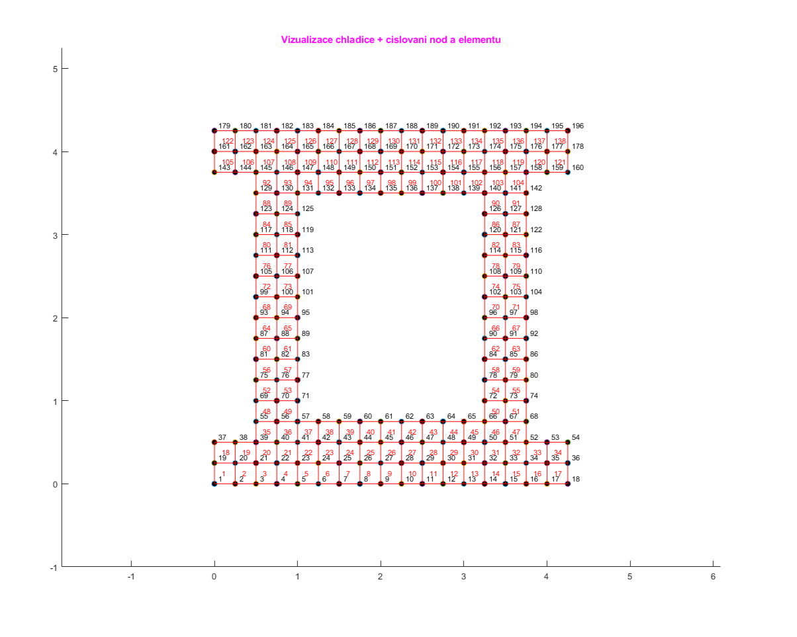
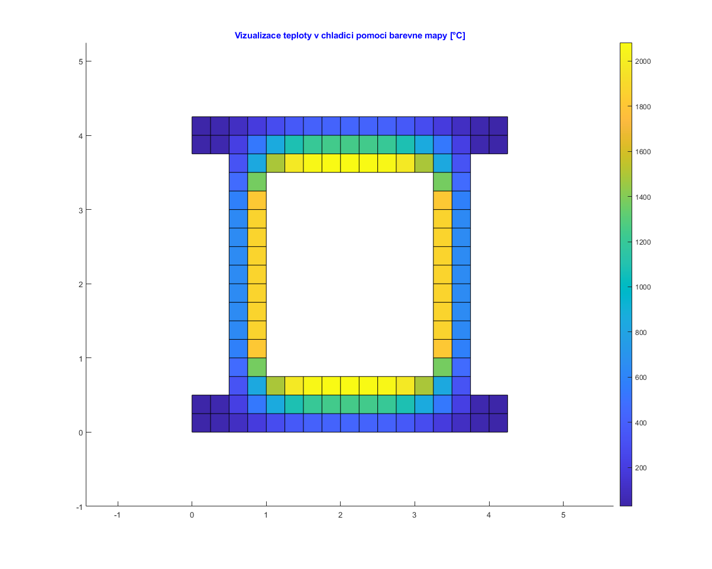
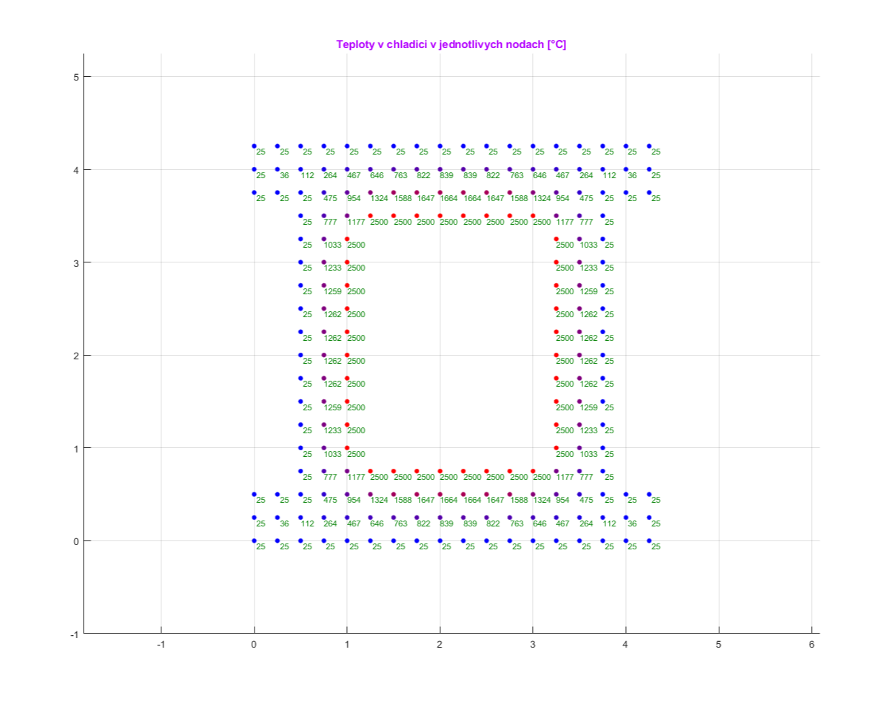
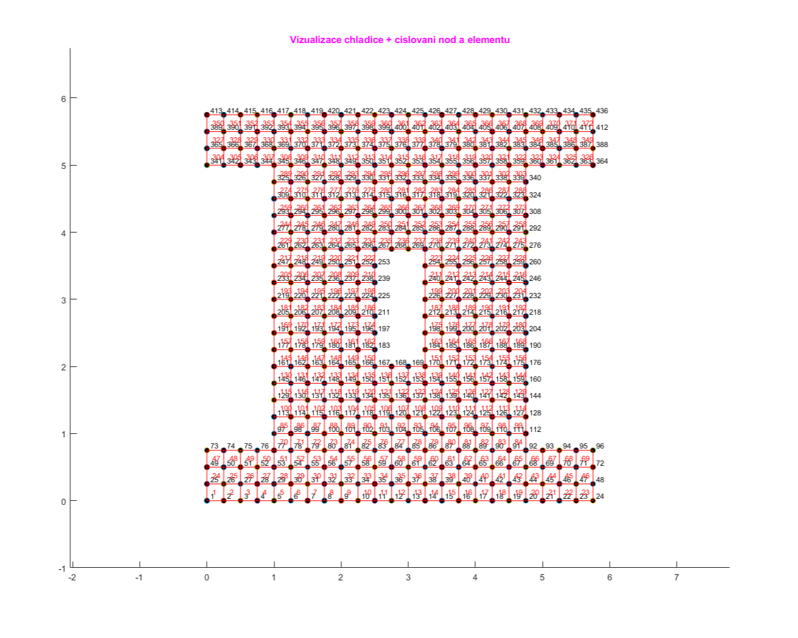
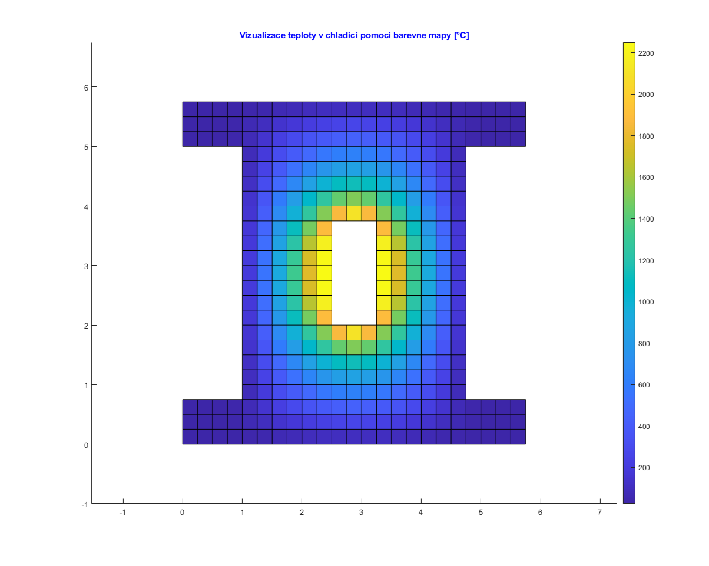
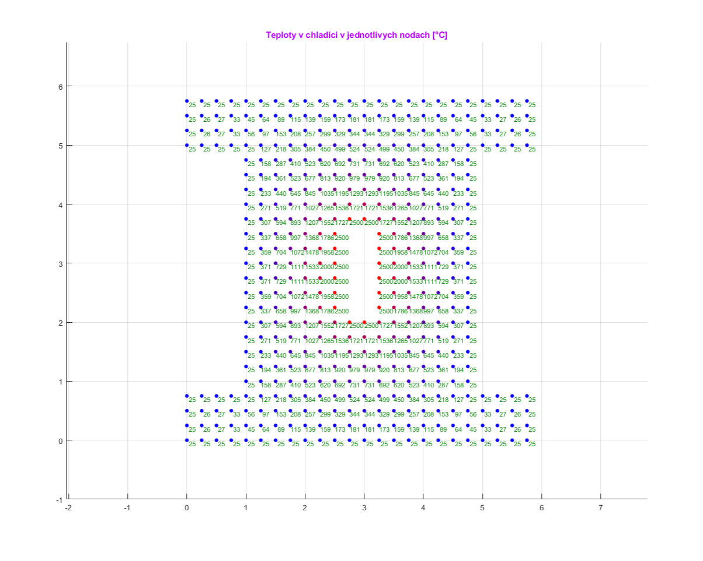
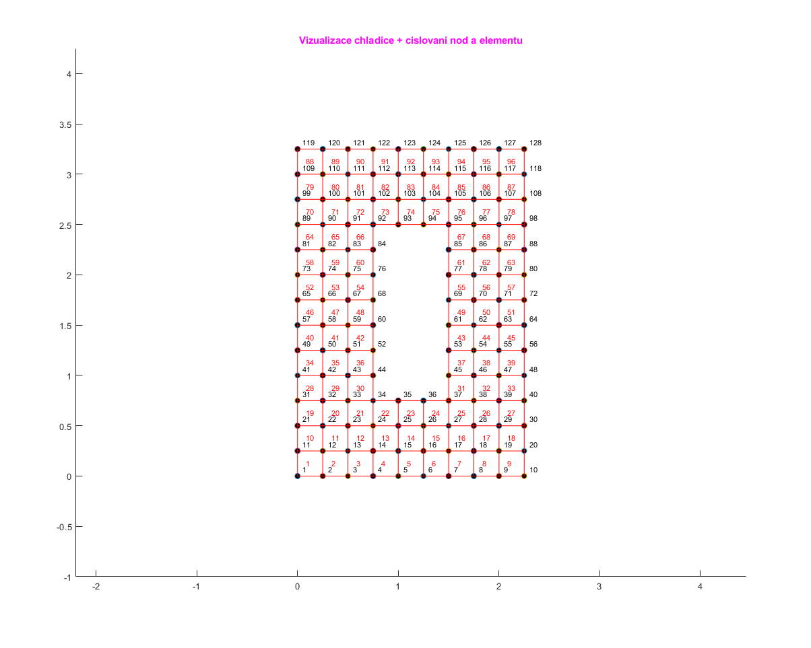
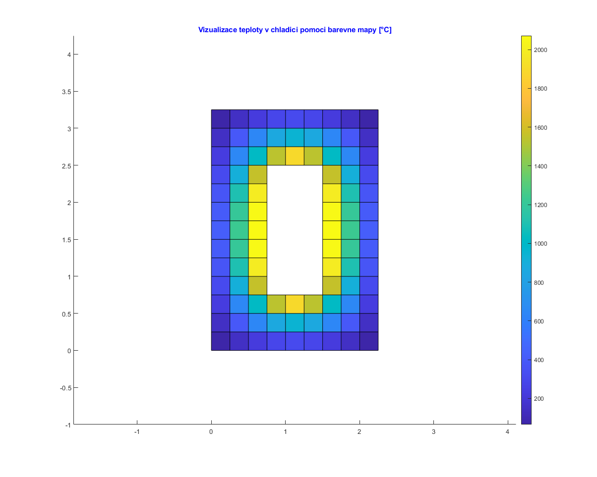
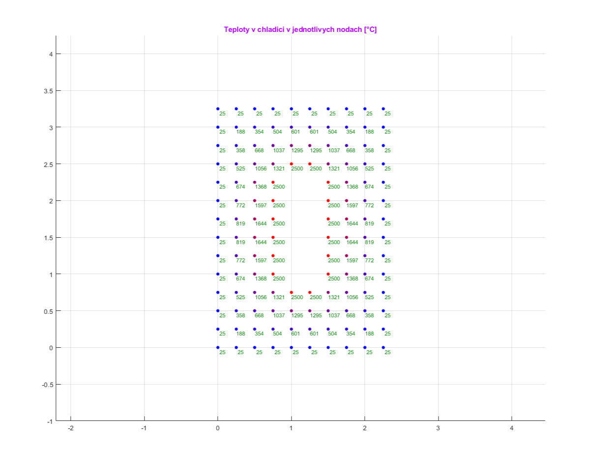

# fem-heat-transfer-radiator
2D FEM simulation of heat transfer in a radiator using linear square elements, with configurable geometry, heat source, and boundary conditions.

## Description
This project contains a 2D Finite Element Method (FEM) model of a radiator, implemented with linear square elements.

The radiator geometry consists of a rectangular body with extended top and bottom bases, protruding beyond the main rectangle.  
The outer boundary of the radiator is subject to a Dirichlet condition (fixed temperature), while the center of the body contains a heat source represented by a Neumann condition (prescribed heat flux).

Key features:
- Adjustable mesh density (element size and count)
- Configurable heat source size and position
- Customizable top/bottom base extensions
- Adjustable external temperature and applied heat flux
- Fully parameterized geometry and boundary conditions

This simulation can be used for studying steady-state heat conduction problems with mixed Dirichlet–Neumann boundary conditions in 2D geometries.

## How to Run

- The code can be found in /src
- Can be run via the Matlab interface
- Adjusting is done in the code directly (see code)

## Example Results

Below are example outputs of the 2D FEM radiator simulation:

- **Geometry:** rectangular body with extended top and bottom bases  
- **Body Mesh:** 13 × 13 linear square elements, with 2 element high base protruding 2 elements to the sides and 11 × 9 element heat source
- **Element Size:** 0.25 m × 0.25 m
- **Outer boundary temperature:** 25 °C (Dirichlet)  
- **Central heat source flux:** 10000 W/m² (Neumann)  

The figure above shows the visualisation of the radiator, the elements and nodes, with corresponding numbering.

The figure above shows the Heat Colormap of the temperature transfer in the radiator.

The figure above shows the node temperatures output in the radiator.

- **Geometry:** rectangular body with extended top and bottom bases  
- **Body Mesh:** 15 × 17 linear square elements, with 3 element high base protruding 4 elements to the sides and 3 × 7 element heat source
- **Element Size:** 0.25 m × 0.25 m
- **Outer boundary temperature:** 25 °C (Dirichlet)  
- **Central heat source flux:** 10000 W/m² (Neumann)  

The figure above shows the visualisation of the radiator, the elements and nodes, with corresponding numbering.

The figure above shows the Heat Colormap of the temperature transfer in the radiator.

The figure above shows the node temperatures output in the radiator.

- **Geometry:** rectangular body with extended top and bottom bases  
- **Body Mesh:** 9 × 13 linear square elements, with no base and 3 × 7 element heat source
- **Element Size:** 0.25 m × 0.25 m
- **Outer boundary temperature:** 25 °C (Dirichlet)  
- **Central heat source flux:** 10000 W/m² (Neumann)  

The figure above shows the visualisation of the radiator, the elements and nodes, with corresponding numbering.

The figure above shows the Heat Colormap of the temperature transfer in the radiator.

The figure above shows the node temperatures output in the radiator.

